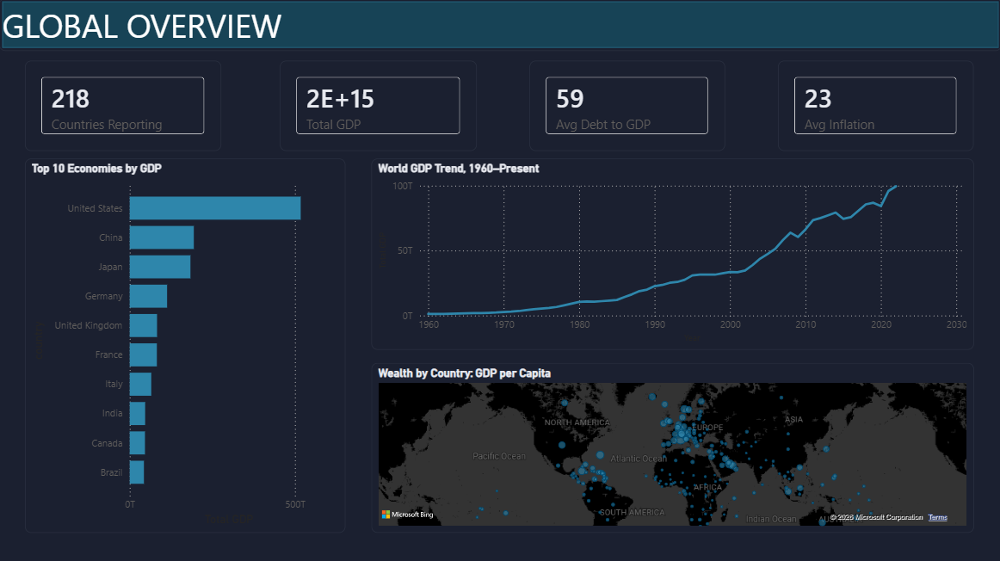
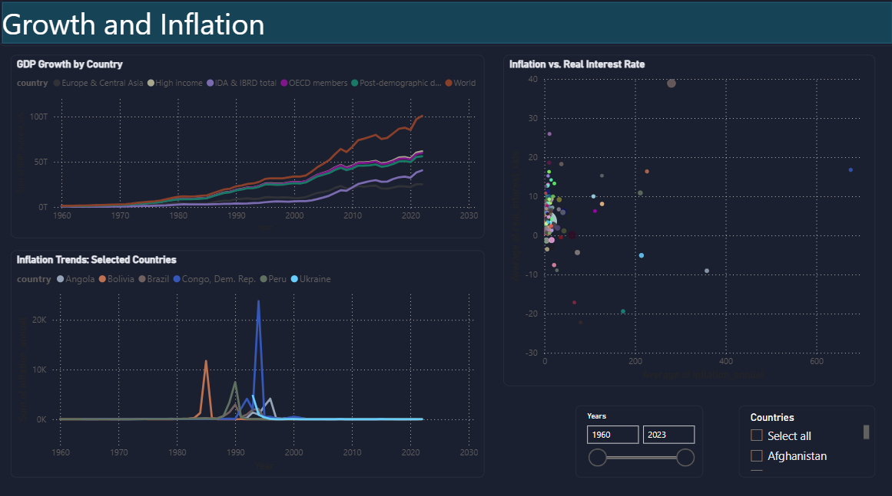
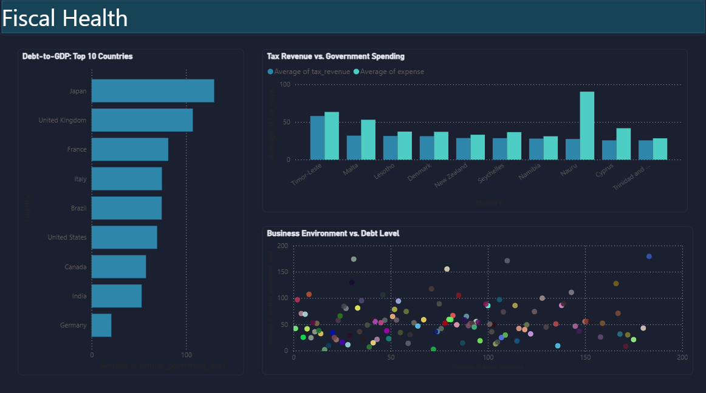

## Global Economic Development Dashboard

**An interactive Power BI dashboard analyzing 60+ years of economic data across 190+ countries, built from raw, messy World Bank data into a polished, decision-ready analytical tool.**

---

## Project Overview

This dashboard transforms a raw, 50-column World Bank dataset (1960–2023) into a four-page interactive story covering global GDP, growth, inflation, and fiscal health. It's built to answer the questions an economist, policy analyst, or investor would actually ask: *Which economies are largest? Where is inflation volatile? Which governments are fiscally overextended? How does one country compare against the world?*

More than a chart collection, this project demonstrates a full BI workflow — from spotting and fixing hidden data integrity issues, through building a clean semantic model with custom DAX, to designing a cohesive, presentation-ready visual experience.

---

## The Data Challenge

The source dataset looked deceptively simple: one flat table, `country` + `date` + 48 economic indicators. But a closer inspection revealed several problems that would have silently corrupted every downstream calculation if left unaddressed:

### 1. Hidden aggregate rows masquerading as countries
Buried inside the `country` column were 50+ entries that weren't countries at all. They were World Bank **regional and income-group rollups**: `World`, `High income`, `OECD members`, `Sub-Saharan Africa`, `Euro area`, and dozens more. Each of these rows already contains the *summed value of every country in that group*.

**Why this matters:** any naive `SUM(GDP)` across the table wouldn't just be wrong, it would be catastrophically wrong, since `World`'s GDP figure would get added on top of the real countries that already make it up, effectively double- (or triple-, or tenfold-) counting the global economy.

**The fix:** rather than deleting these rows (they're genuinely useful for benchmarking e.g: "how does this country compare to its region?"), I engineered an **`IsAggregate` boolean column** that tags every row as either a real country or a rollup entity, using a curated reference list of all known World Bank aggregate names. Every measure in the model then explicitly filters `IsAggregate = FALSE`, keeping totals and rankings mathematically honest while preserving the aggregate rows for future benchmark comparisons.

```dax
Total GDP = 
CALCULATE(SUM('dataset'[GDP_current_US]), 'dataset'[IsAggregate] = FALSE)
```

This one modeling decision is the difference between a dashboard that *looks* right and one that *is* right.

### 2. Inconsistent country identities
The same country appeared under two different names with two different date ranges — `Czechia` (1960–2023) vs. `Czech Republic` (1990–2020), and `Vietnam` vs. `Viet Nam`. Left unresolved, this would silently split a single nation's data across two "different" entities in every visual and filter. Standardized to one consistent name per country, keeping the fuller historical series.

### 3. Silent nulls disguised as empty strings
Some missing values weren't stored as proper `null` — they were empty strings that Power Query displayed as blank cells with no "null" indicator, unlike true nulls. Normalized these so every visual and measure treats missing data consistently.

### 4. Reporting lag in recent years
Cross-checking coverage by year revealed that the most recent years (2022–2023) have dramatically sparser data than mid-2010s years — a real-world characteristic of how economic indicators get reported, not a data error. This directly informed dashboard defaults (Year slicers default to well-covered years rather than the most recent one) to avoid showing viewers a misleadingly empty snapshot.

---

## Data Modeling & DAX

Built on a single, well-typed flat table with a purpose-built measure layer rather than relying on raw columns directly in visuals, this keeps every calculation centralized, auditable, and reusable across all four pages.

**Key measures include:**
- `Total GDP` / `Total GDP (All Years)` — aggregate-safe totals, with a time-intelligence variant that stays stable regardless of slicer state, purpose-built for trend lines that shouldn't collapse to a single point
- `GDP per Capita` — a derived economic indicator not present in the source data, calculated as `Total GDP ÷ Total Population`
- `GDP YoY Growth %` — a year-over-year comparison measure using `CALCULATE` + `FILTER` + `ALL` to look up the prior year's value dynamically, without a dedicated date table
- `Global Avg Debt to GDP` — a context-breaking benchmark measure (using `ALL('dataset'[country])`) that powers the "this country vs. the world" comparison on the deep-dive page

Every rate-based indicator (inflation, interest rates, debt-to-GDP, tax revenue) is deliberately aggregated with **AVERAGE, never SUM** — percentages don't accumulate meaningfully across years, and treating them as if they did would produce nonsensical figures (a 5% and 6% inflation year "summing" to a meaningless 11%, rather than reflecting a genuine ~5.5% average trend).

---

## Design System

Rather than defaulting to Power BI's out-of-the-box theme, this dashboard runs on a **custom-built JSON theme file**. A deliberate, financial-terminal-inspired dark palette designed for a global economics narrative:

| Element | Color | Purpose |
|---|---|---|
| Canvas / cards | `#10131C` / `#1B2030` | Deep navy base, low-glare for data-dense reading |
| GDP metrics | `#2E86AB` | Consistent blue across every GDP visual, every page |
| Inflation / caution | `#F2B134` | Amber — a single meaning, never reused |
| Debt / risk | `#F25C54` | Coral-red, reserved exclusively for risk indicators |

**One color, one meaning, every page.** This discipline, never letting the same hex code represent two different metrics, is what makes a four-page, eighteen-visual dashboard read as a single coherent product instead of four disconnected charts stitched together.

---

## The Four Pages

1. **Global Overview**
The 30-second snapshot: total GDP, inflation, debt, and country coverage as KPI cards, a choropleth map of wealth distribution, a ranked bar chart of the world's largest economies, and a 60+ year world GDP trend line.


2. **Growth & Inflation**  
The volatility story: multi-country GDP and inflation trend lines, plus a scatter chart testing the real relationship between inflation and real interest rates, sized by economic weight.


3. **Fiscal Health**  
The sustainability story: which governments are running deficits, which are carrying dangerous debt loads (benchmarked against a 60% debt-to-GDP reference line), and whether business-friendly regulation correlates with fiscal discipline.


4. **Country Deep-Dive**  
A drillthrough page that lets user right-click a country anywhere in the dashboard and land on a fully personalized view: that country's GDP trend, inflation history, spending patterns, and — critically — how it stacks up against the global average, not just in isolation.


---

## Tools & Techniques

- **Power Query (M)** — column typing, custom conditional logic for aggregate detection, duplicate resolution, null normalization
- **DAX** — CALCULATE/FILTER/ALL patterns for time intelligence and context-overriding benchmark measures
- **Power BI Desktop** — custom JSON theming, drillthrough pages, synced slicers, dual-axis and small-multiple visuals
- **Data source:** World Bank global development indicators (via Kaggle), 1960–2023, 190+ countries

---

## What This Project Demonstrates

This isn't just "make some charts from a CSV." It's a case study in the unglamorous-but-essential work that separates a trustworthy dashboard from a misleading one: catching a data structure that would silently double-count global GDP, deciding *when* a percentage should never be summed, and building a measure layer disciplined enough that every visual across four pages can trust the same underlying logic. The visual polish is the last 10% — the modeling integrity underneath it is the part that actually matters.

---
## Author
Kaif ul Wara

LinkedIn: linkedin.com/in/kaifulwara19     Email: kaifulwara348@gmail.com

## License
This project uses publicly available data from Kaggle under their dataset terms of use. Raw csv file is also provided in this folder. The dashboard and analysis are original work.

⭐ If you found this project useful, please star the repository! Dataset: World Bank Development Indicators via Kaggle
