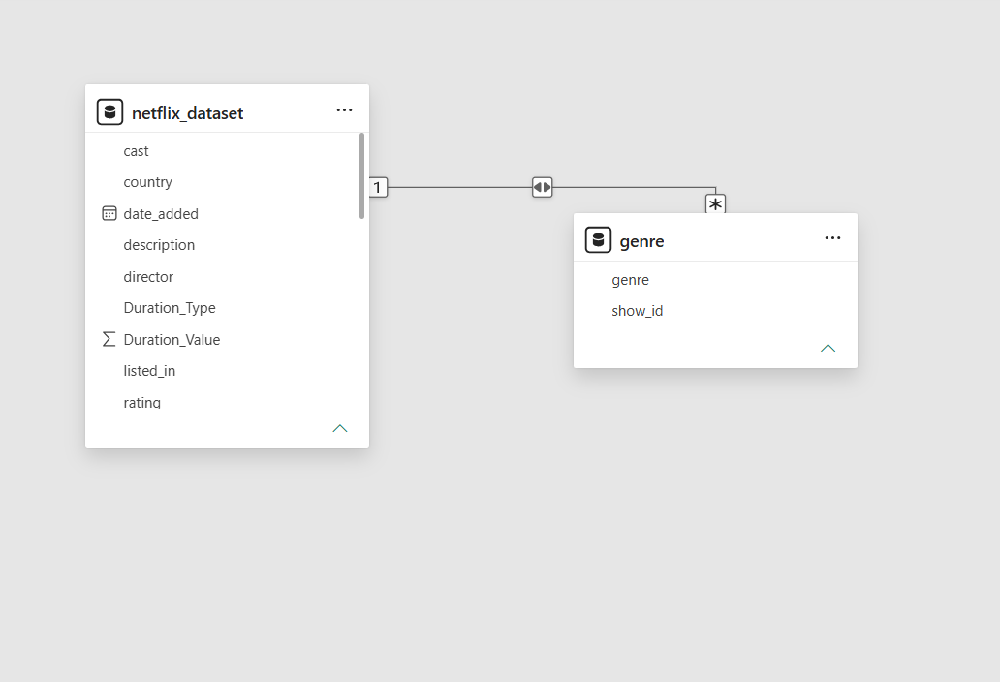
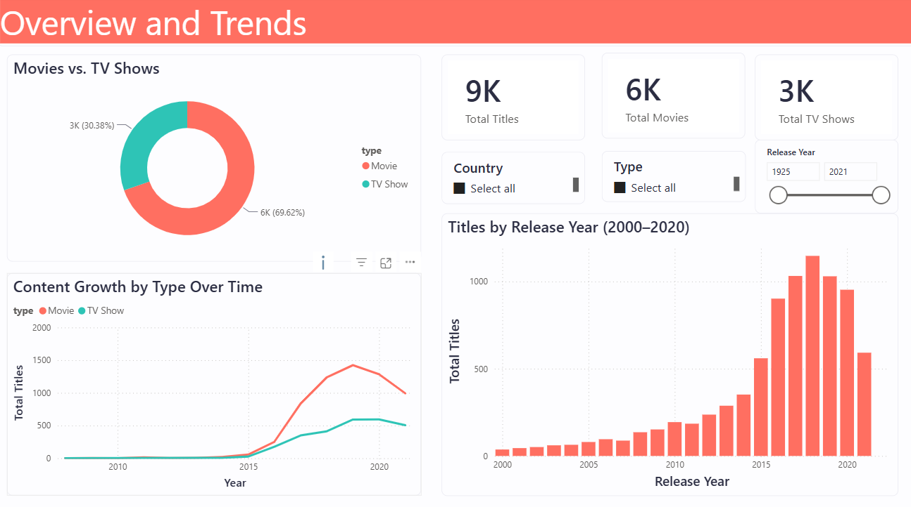
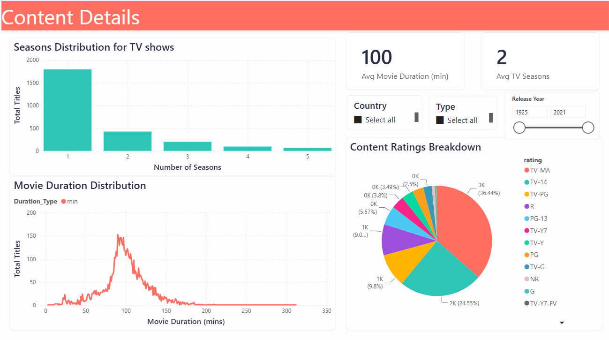

## Netflix Content Dashboard

A 3-page interactive Power BI dashboard exploring Netflix's content catalog, built as a portfolio project using the public [Netflix Movies and TV Shows dataset](https://www.kaggle.com/datasets/shivamb/netflix-shows) from Kaggle.

---

## Overview

This dashboard analyzes ~8,800 Netflix titles across content type, genre, country of origin, release trends, ratings, and runtime, designed with a custom theme. A light, colorful and high-contrast palette.

**Pages:**
1. **Overview and Trends** — high-level KPIs, Movie vs TV Show split, release trends over time
2. **Genre and Geography** — top genres, global content distribution, top content-producing countries
3. **Content Details** — runtime distribution, ratings breakdown, average duration/seasons

---

## Data Cleaning (Power Query)

Key cleaning steps applied before modeling:

| Issue | Fix |
|---|---|
| Auto-generated "Changed Type" step threw errors | Removed and manually re-typed each column |
| `date_added` stored as text ("September 25, 2021") | Converted to a valid Date Format |
| `duration` mixed units ("90 min" vs "2 Seasons") | Split into `Duration_Value` (number) and `Duration_Type` (min/Season) |
| Known data-entry bug — duration values misplaced into `rating` | Custom column to null out invalid rating entries |
| One row (show_id 8422) had shifted/corrupted columns due to an unescaped comma in the source CSV | Removed via **Remove Errors** on affected columns |
| `country` field had multiple comma-separated countries per row | Extracted `Primary_Country` (first listed country) for map/bar visuals |
| `listed_in` (genre) had multiple comma-separated genres per row | Built a separate **`genre` bridge table** (Reference → Split by delimiter → Split into **Rows**), related back to the main table via `show_id`, with cross-filter direction set to **Both** |
| Nulls in `director`, `cast`, `country` | Left as genuine nulls (real missing data, not cleaned away) |

---

## Data Model

- `netflix_dataset` — main fact table, one row per title
- `genre` — bridge table (`show_id` ↔ `genre`), one-to-many relationship, **cross-filter direction: Both**
- `Date Table` — standalone calendar table (DAX CALENDAR()), related to date_added used for time-intelligence function



> **Note:** Time-intelligence DAX measures (YoY Growth, Titles This Year, etc.) were tested but excluded from the final build because they introduced inconsistencies during validation. The Date Table was also excluded because it was only needed for time-intelligence measures.

---

## Dashboard Pages & Visuals

### Page 1 — Overview and Trends
- KPI Cards: Total Titles, Total Movies, Total TV Shows
- Donut Chart: Movies vs TV Shows
- Line Chart: Content Growth by Type Over the Years
- Column Chart: Titles Released by Year (filtered 2000–2020)



### Page 2 — Genre and Geography
- KPI Cards: Distinct Countries, Distinct Genres
- Bar Chart: Top Genres on Netflix
- Filled Map: Global Content Distribution (color saturation by title count)
- Bar Chart: Top 5 Content-Producing Countries


### Page 3 — Content Details
- KPI Cards: Avg Movie Duration, Avg TV Seasons
- Column Chart: Movie Runtime Distribution
- Line Chart: Runtime Trend
- Pie Chart: Content Ratings Breakdown



**Global slicers:** `type`, `release_year`, `rating`, `Primary_Country`

---

## DAX Measures

```dax
Total Titles = COUNTROWS(netflix_dataset)
Total Movies = CALCULATE([Total Titles], netflix_dataset[type] = "Movie")
Total TV Shows = CALCULATE([Total Titles], netflix_dataset[type] = "TV Show")
% Movies = DIVIDE([Total Movies], [Total Titles])
% TV Shows = DIVIDE([Total TV Shows], [Total Titles])

Distinct Countries = DISTINCTCOUNT(netflix_dataset[Primary_Country])
Distinct Genres = DISTINCTCOUNT(genre[genre])
Distinct Directors = DISTINCTCOUNT(netflix_dataset[director])
Distinct Ratings = DISTINCTCOUNT(netflix_dataset[rating])

Avg Movie Duration (min) =
AVERAGEX(FILTER(netflix_dataset, netflix_dataset[type] = "Movie"), netflix_dataset[Duration_Value])

Avg TV Seasons =
AVERAGEX(FILTER(netflix_dataset, netflix_dataset[type] = "TV Show"), netflix_dataset[Duration_Value])

Longest Movie (min) = CALCULATE(MAX(netflix_dataset[Duration_Value]), netflix_dataset[type] = "Movie")
Shortest Movie (min) = CALCULATE(MIN(netflix_dataset[Duration_Value]), netflix_dataset[type] = "Movie")
Max TV Seasons = CALCULATE(MAX(netflix_dataset[Duration_Value]), netflix_dataset[type] = "TV Show")

Latest Release Year = MAX(netflix_dataset[release_year])
Earliest Release Year = MIN(netflix_dataset[release_year])
Avg Release Year = AVERAGE(netflix_dataset[release_year])
```

---

## Design

A custom light, colorful Power BI theme was applied — a bright, high-contrast palette.

- **Background:** White (#FFFFFF), with subtly off-white card backgrounds (#FDFDFF) and soft rounded borders (#EAEAF2)
- **Text:** Dark slate (#2B2D42) for titles/labels, muted grey-blue (#7B7F9E) for category labels
- **Data color palette:** 8 rotating accent colors — coral (#FF6F61), teal (#2EC4B6), amber (#FFB400), purple (#9D4EDD), sky blue (#4CC9F0), pink (#F72585), green (#06D6A0), orange (#FF9F1C) — used across genre, country, and category-based charts for clear visual distinction
- **Status colors:** Green (#06D6A0) for positive/good values, amber (#FFB400) for neutral, coral (#FF6F61) for negative/bad — available for any conditional formatting
- **KPI cards:** Large dark-slate callout numbers (32pt, Segoe UI Semibold) with smaller grey category labels beneath
- **Typography:** Segoe UI / Segoe UI Semibold throughout, for a clean, modern analytics feel

---

##  Known Limitations

- `Primary_Country` uses only the **first listed country** per title for map/bar visuals — titles with multiple co-production countries are attributed to one country only, which slightly understates smaller contributing countries.
- A small number of rows have null `director`, `cast`, or `country` — these are genuine gaps in the source data and were left blank rather than imputed.
- One corrupted source row (misaligned columns due to an unescaped comma in the original CSV) was removed rather than manually repaired.
- Time-intelligence measures (YoY growth, etc.) were intentionally omitted after producing inconsistent results during testing.

---

## Tools Used

- Power BI Desktop
- Power Query (M)
- DAX

---

## Dataset
Source: Kaggle — Netflix Movies and TV Shows
Rows: ~8,800 titles
Columns: show_id, type, title, director, cast, country, date_added, release_year, rating, duration, listed_in, description

---

## Author
Kaif ul Wara

LinkedIn: linkedin.com/in/kaifulwara19  Email: kaifulwara348@gmail.com

## License
This project uses publicly available data from Kaggle under their dataset terms of use. Raw csv file is also provided in this folder. The dashboard and analysis are original work.

⭐ If you found this project useful, please star the repository! Dataset: World Bank Development Indicators via Kaggle
